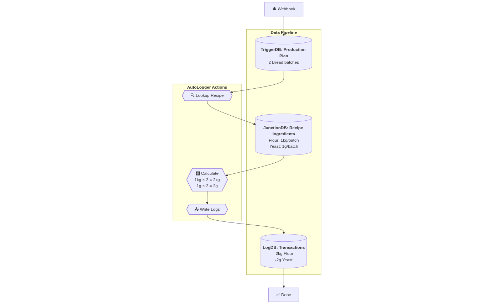

# Notion Cascade Insert


<!-- WARNING: THIS FILE WAS AUTOGENERATED! DO NOT EDIT! -->

## Installing

``` python
! pip install notion_cascade_insert
```

## How to use

### Building blocks

This package is built to emulate the `Notion Automation` function but
with one to many relation. I built this to track the transactions (hence
the log) that involves calculating in case where there is an big object
that map to many other objects, like when you have a recipe and you want
to get the ingredients, or when you have a lists of guests and you want
to get their details… This helps you manage the ammoun of stuff that
relate to that big object.

There are 4 of the pipelines:

1.  **TriggerDB**: monitors a database for status changes  
2.  **JunctionDB**: looks up related items and amounts  
3.  **LogDB**: writes transaction logs  
4.  **AutoLogger**: orchestrates the flow

We can than use them to connect to `Notion Webhook` and create the
functions that we want.

### Example

<!--  -->


Let’s say we’re building a Bakery Inventory management database, and we
want our `Production Plan` database to automatically log the used
ingredients in a recipe that we want to make. This is a one-to-many
behavior, which Notion don’t support at the momment. For this, we would
do something like:

``` python
from notion_cascade_insert.core import TriggerDB, JunctionDB, LogDB, AutoLogger
from notion_cascade_insert.webhook import NotionWebhook 
from fastapi import FastAPI, Request 
from notion_client import Client 
import os
```

``` python
notion = Client(auth=os.getenv("NOTION_TOKEN"))

trigger = TriggerDB(os.getenv("PRODUCTION_PLAN_DB_ID"), notion, "Status", "Recipes", "Batches to make")
junction = JunctionDB(os.getenv("RECIPE_INGREDIENTS_DB_ID"), notion, "Recipes", "Ingredient Inventory", "Amount per batch")
log = LogDB(os.getenv("INGREDIENT_TRANSACTION_DB"), notion, "Ingredient", "Amount", "Production Plan", "Reason")
db_logger = AutoLogger(trigger, junction, log, "In Process", -1)
```

This will create your Ingredient Logger! Then you can set up your server
like so:

``` python
app = FastAPI()

@app.post("/webhook")
async def webhook(request: Request):
    hook = NotionWebhook(await request.json())
    if hook.parent_db_id == os.getenv("PRODUCTION_PLAN_DB_ID"):
        if hook.type == 'page.created': return {"result": db_logger.process(hook.entity_id)}
    return {"status": "received"}
```
